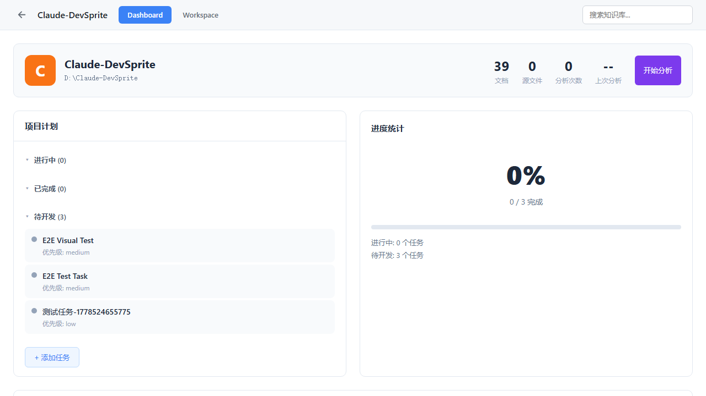
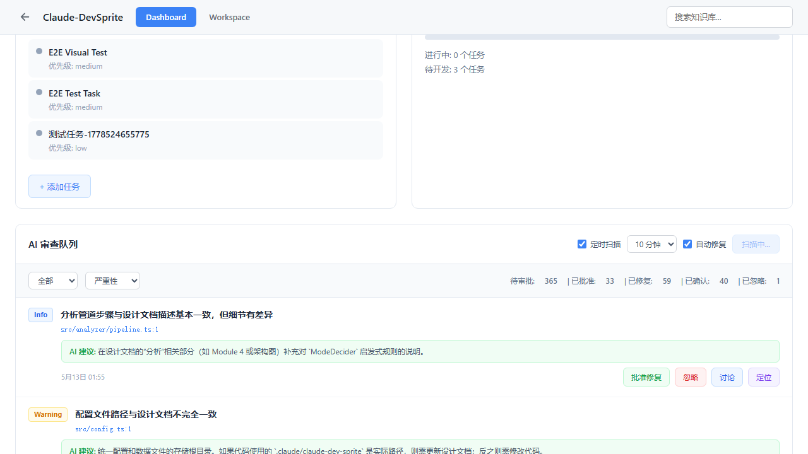

# 04. 测试验证

## Playwright 测试结果

```
Running 5 tests using 1 worker

  ok 1 › 01: batch fix API with non-existent IDs returns empty results (1.7s)
  ok 2 › 02: scan endpoint returns findingsCount (18.2s)
  ok 3 › 03: scan creates new pending reviews (27.1s)
  ok 4 › 04: auto-fix checkbox triggers scan+fix flow (5.6s)
  ok 5 › 05: no console errors (3.8s)

  5 passed (57.6s)
```

## 截图验证

### Test 01: API 结构验证

使用不存在的 reviewIds [999999] 调用 fix-batch API：
- 返回 `{ fixed: 0, confirmed: 0, failed: 0, results: [] }`
- ✅ 立即返回，无 AI 调用



---

### Test 02: 扫描端点返回 findingsCount

扫描发现 2 个不一致：


---

### Test 03: 扫描创建新 pending reviews

扫描前 pending: 361，扫描后 pending: 365（新增 5 个）


---

### Test 04: 自动修复触发扫描+修复流程

勾选"自动修复"后点击扫描：
- 按钮从"开始扫描"变为"扫描中..."
- ✅ 状态正确转换



---

### Test 05: 无控制台错误

✅ 0 个错误

## 测试汇总

| 测试项 | 状态 |
|--------|------|
| fix-batch API 接受 reviewIds | ✅ PASS |
| scan 返回 findingsCount | ✅ PASS |
| scan 创建新 pending reviews | ✅ PASS |
| auto-fix 触发 scan+fix 流程 | ✅ PASS |
| 无控制台错误 | ✅ PASS |
