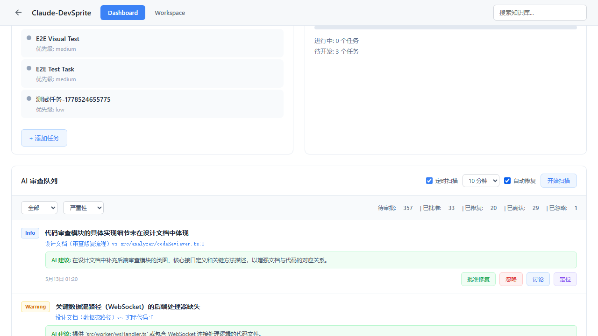
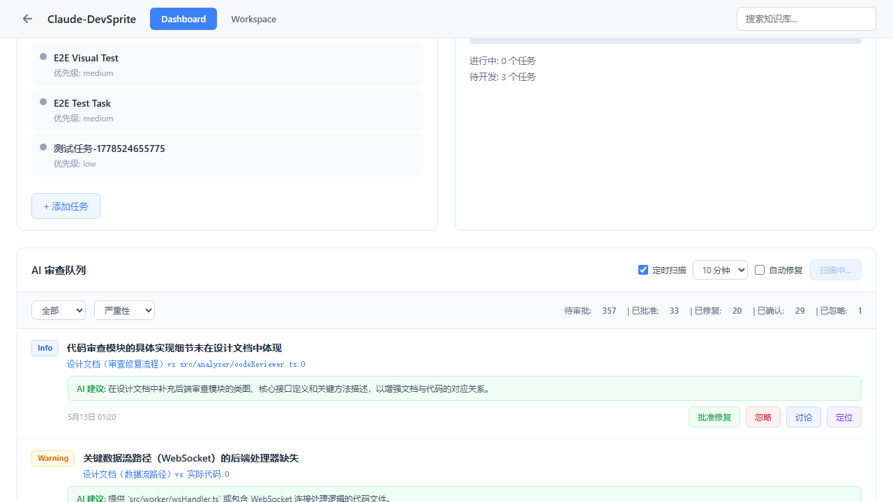

# 02. Bug 发现

## 复现步骤

### Bug 1: 自动修复勾选状态丢失

1. 打开 Dashboard 页面
2. 滚动到"AI 审查队列"
3. 勾选"自动修复"复选框
4. **刷新页面**
5. **结果**: 自动修复复选框恢复为未勾选

### Bug 2: 扫描中状态丢失

1. 打开 Dashboard 页面
2. 点击"开始扫描"按钮
3. 按钮显示"扫描中..."
4. **刷新页面**
5. **结果**: 按钮恢复为"开始扫描"，不知道扫描是否仍在进行

## 截图证据

### Bug 1 复现

勾选"自动修复"后:

刷新后:

### Bug 2 复现

扫描中:

## 测试数据

| 测试场景 | 修复前结果 | 修复后结果 |
|---------|-----------|-----------|
| 勾选后刷新 | ❌ 复选框恢复未勾选 | ✅ 复选框保持勾选 |
| 取消勾选后刷新 | N/A | ✅ 复选框保持未勾选 |
| 扫描中刷新 | ❌ 按钮恢复"开始扫描" | ✅ 按钮显示"扫描中..." |
