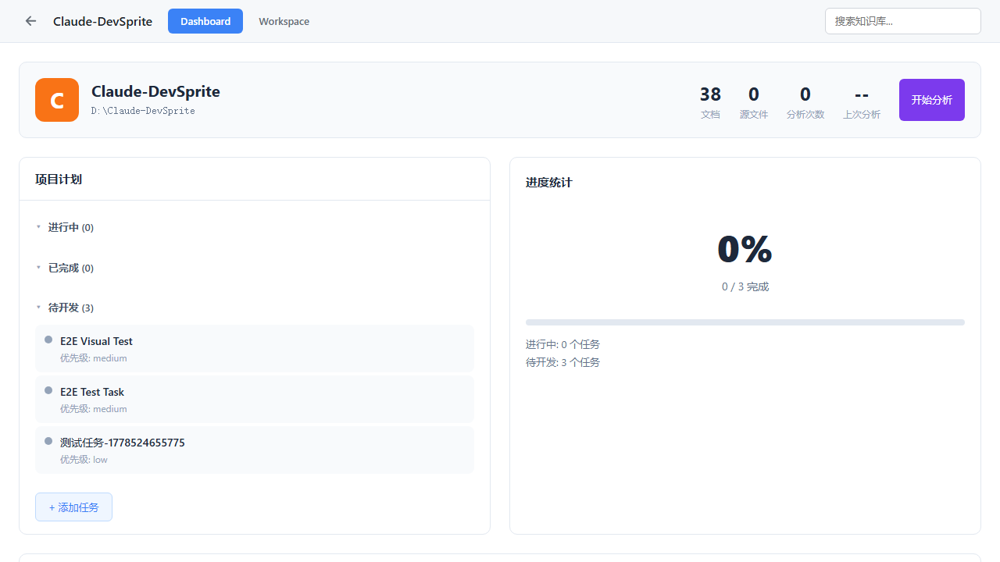
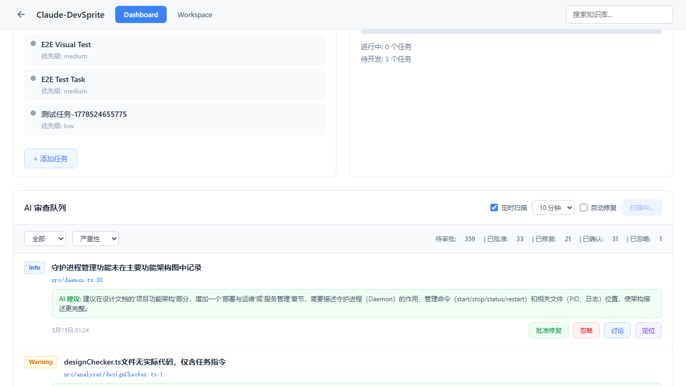

# 05. 测试验证

## 测试环境

- 操作系统: Windows 10 Pro
- 浏览器: Chromium (Playwright headless)
- Node.js: v24+
- 服务地址: http://127.0.0.1:38888
- 测试文件: `tests/e2e/autofix-state-persistence.spec.ts`

## Playwright 测试结果

```
Running 7 tests using 1 worker

  ok 1 › 01: auto-fix checkbox is visible (1.7s)
  ok 2 › 02: auto-fix checkbox persists after refresh (checked) (3.6s)
  ok 3 › 03: auto-fix checkbox persists after refresh (unchecked) (3.4s)
  ok 4 › 04: scanning state shows when backend is scanning (1.7s)
  ok 5 › 05: scan button text changes during scan (28.0s)
  ok 6 › 06: refresh during scan shows scanning state (3.1s)
  ok 7 › 07: no console errors (3.8s)

  7 passed (46.4s)
```

## 截图验证

### Test 01: 自动修复复选框可见


**状态**: ✅ 通过

---

### Test 02: 勾选后刷新保持

勾选状态:


刷新后:


**结果**: 刷新后复选框仍然勾选 ✅

---

### Test 03: 取消勾选后刷新保持


**结果**: 取消勾选后刷新，复选框保持未勾选 ✅

---

### Test 04: 扫描按钮状态



**结果**: 按钮正确显示"开始扫描"（后端未扫描时） ✅

---

### Test 05: 扫描中按钮文本


**结果**: 扫描中按钮显示"扫描中..." ✅

---

### Test 06: 刷新期间扫描状态

扫描开始后:


**结果**: 扫描中刷新页面，按钮恢复为"扫描中..." ✅

---

### Test 07: 无控制台错误


**结果**: 0 个控制台错误 ✅

---

## 测试汇总

| 测试项 | 修复前 | 修复后 | 状态 |
|--------|--------|--------|------|
| 自动修复复选框可见 | ✅ | ✅ | PASS |
| 勾选后刷新保持 | ❌ 失败 | ✅ 保持勾选 | PASS |
| 取消勾选后刷新保持 | N/A | ✅ 保持未勾选 | PASS |
| 扫描按钮状态 | ✅ | ✅ | PASS |
| 扫描中按钮文本 | ✅ | ✅ "扫描中..." | PASS |
| 刷新期间扫描状态 | ❌ 失败 | ✅ 显示"扫描中..." | PASS |
| 无控制台错误 | - | ✅ 0 个 | PASS |

## 结论

所有 7 个 Playwright 测试通过，修复有效。两个状态持久化问题均已解决。
